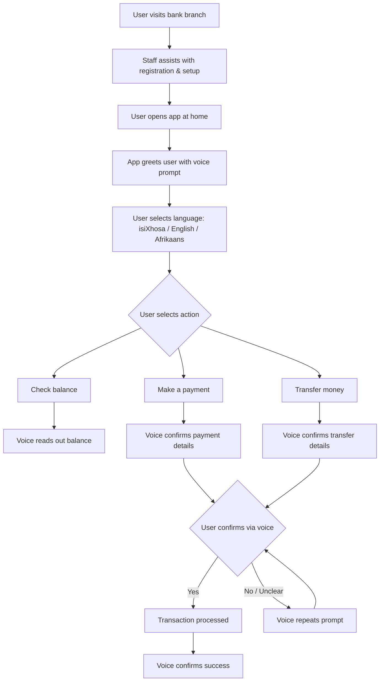

 Process Flow

```mermaid
flowchart TD
    A[User visits bank branch] --> B[Staff assists with registration & setup]
    B --> C[User opens app at home]
    C --> D[App greets user with voice prompt]
    D --> E[User selects language: isiXhosa / English / Afrikaans]
    E --> F{User selects action}
    F --> G[Check balance]
    F --> H[Make a payment]
    F --> I[Transfer money]
    G --> J[Voice reads out balance]
    H --> K[Voice confirms payment details]
    I --> L[Voice confirms transfer details]
    K --> M{User confirms via voice}
    L --> M
    M -->|Yes| N[Transaction processed]
    M -->|No / Unclear| O[Voice repeats prompt]
    O --> M
    N --> P[Voice confirms success]
```
